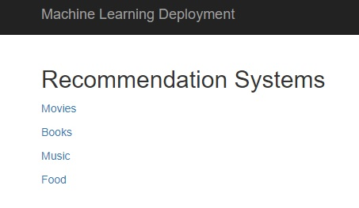
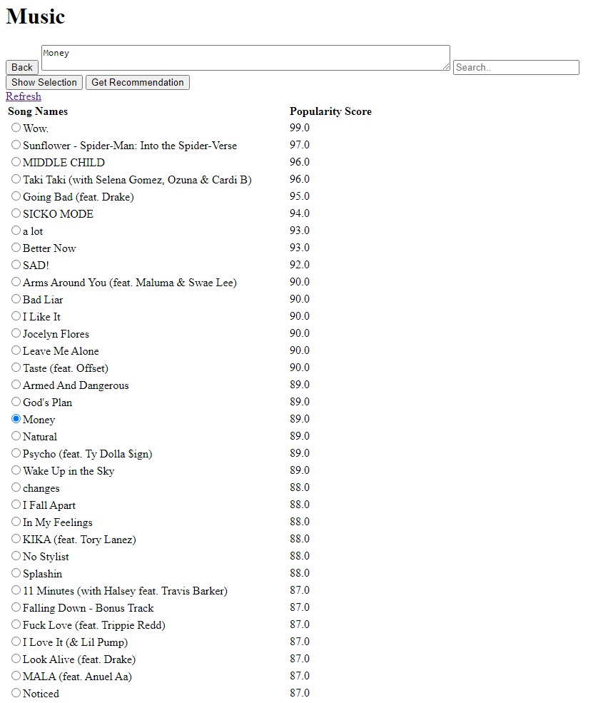
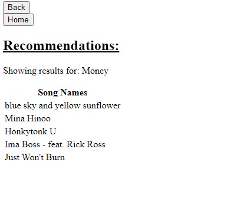

# ML Deployment Website

Primitive and simplistic code for a website I made to test ML models and algorithms.
\
[Note]: I'm not focusing on front-end or back-end development in this project. It's mainly to highlight the models.

 

## Homepage

## Music Selection Page

\
I showcased "Music" because it is the best model I made thus far between these systems.

## Recommendation Page

